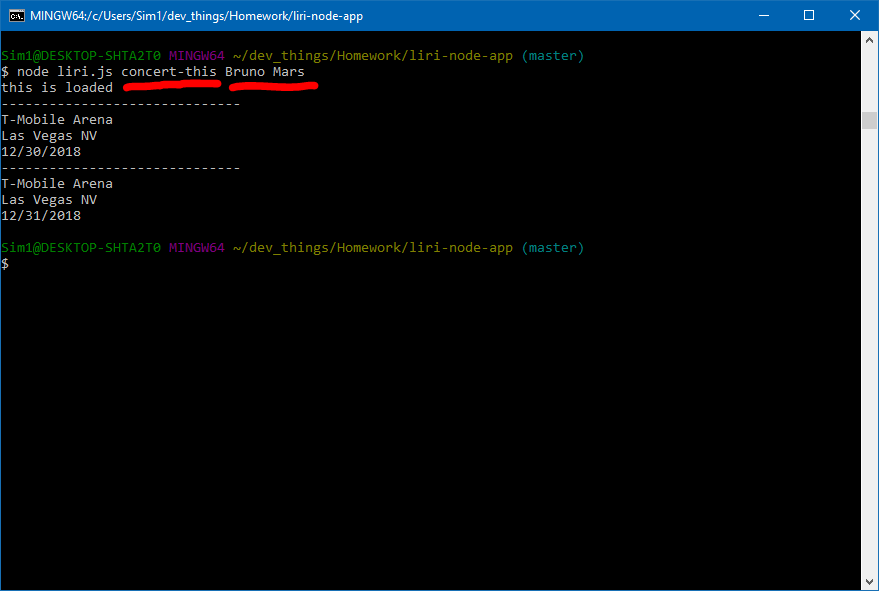

# LIRI-node-app

LIRI (Language Interpretation and Recognition Interface)

### How LIRI Works
A user sends input to various APIs, and using specific commands, will receive relevant info pertaining to their query.
The user is free to search for concert dates, look up a song's artist/album, and search info on a particular movie. 

### Instructions

User's first input is the category of search, which includes four choices:
* <code>concert-this</code> will search current upcoming shows for various artists
* <code>spotify-this-song</code> will return info including artist, album, and a 30-sec preview.
* <code>movie-this</code> will return info about the movie, release date, plot, etc.
* <code>do-what-i-say</code> will return a random search.

Once the category has been chosen, then the user's second input will be their choice as below:

     
The various search categories are demonstrated in the video linked below:
https://drive.google.com/file/d/1AAv14n66YGfzcg-7gkPR8TTE_NPHrboH/view?usp=sharing
      

### Technologies Involved
* Node.js
* node modules, package.json
* Javascript
* BandsInTown API
* Spotify API
* OMDB API
